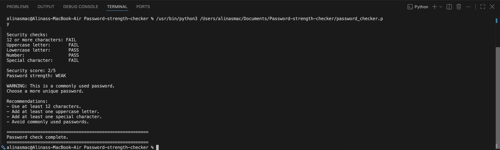
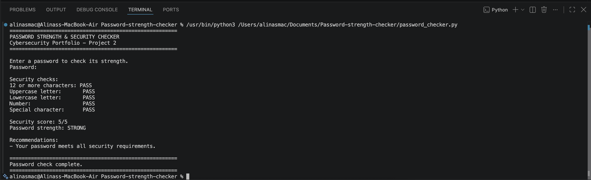
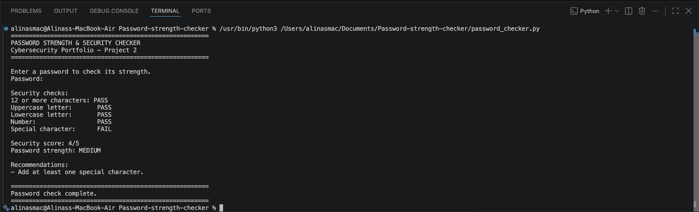

# Password Strength & Security Checker

## Project Overview

This project is a Python-based Password Strength & Security Checker created as part of my cybersecurity portfolio.

The program analyses a password against several security requirements, calculates a security score, identifies commonly used weak passwords, and provides recommendations for improving password security.

The password is entered securely using Python's `getpass` module, which prevents the password from being displayed in the terminal while it is being typed.

## Features

The program checks whether a password:

- Contains at least 12 characters
- Contains an uppercase letter
- Contains a lowercase letter
- Contains a number
- Contains a special character
- Matches a list of commonly used weak passwords

The program calculates a security score from **0 to 5** and classifies the password as:

- **WEAK**
- **MEDIUM**
- **STRONG**

If the password does not meet all requirements, the program provides recommendations explaining how it can be improved.

## Technologies Used

- Python 3
- Regular Expressions (`re`)
- `getpass`
- Visual Studio Code
- GitHub

## How It Works

1. The user enters a password.
2. The password is hidden while being entered.
3. The program checks five password security requirements.
4. A security score from 0 to 5 is calculated.
5. The password is classified as weak, medium, or strong.
6. The password is compared with a list of commonly used passwords.
7. Recommendations are displayed when improvements are required.

## Testing

I tested the program using passwords with different levels of complexity to confirm that the security checks and recommendations work correctly.

### Weak Password

A weak password fails several security requirements. The program identifies the missing requirements and provides recommendations for improving the password.

  

### Medium Password

A medium-strength password meets some of the security requirements but still requires improvements.

  

### Strong Password

A strong password meets all five security requirements and receives a security score of **5/5**.

  

## Security Concepts Demonstrated

This project demonstrates:

- Password security principles
- Password complexity validation
- Secure password input
- Identification of commonly used passwords
- Regular expressions
- Conditional logic
- Security scoring
- User security recommendations
- Basic Python security programming

## What I Learned

Through this project, I improved my understanding of how password security requirements can be implemented programmatically.

I practised using regular expressions to detect uppercase and lowercase letters, numbers, and special characters. I also used conditional logic to evaluate password strength and provide appropriate security recommendations.

Using the `getpass` module also helped me understand the importance of preventing sensitive information such as passwords from being displayed on screen.

This project strengthened my Python skills while helping me understand practical password security concepts used in cybersecurity.

## Ethical and Security Considerations

This project was created for educational purposes as part of my cybersecurity portfolio.

Passwords are analysed locally by the Python program and are not saved to a file or transmitted anywhere. Users should use test passwords rather than real account passwords when experimenting with the program.

---

**Cybersecurity Portfolio – Project 2**
